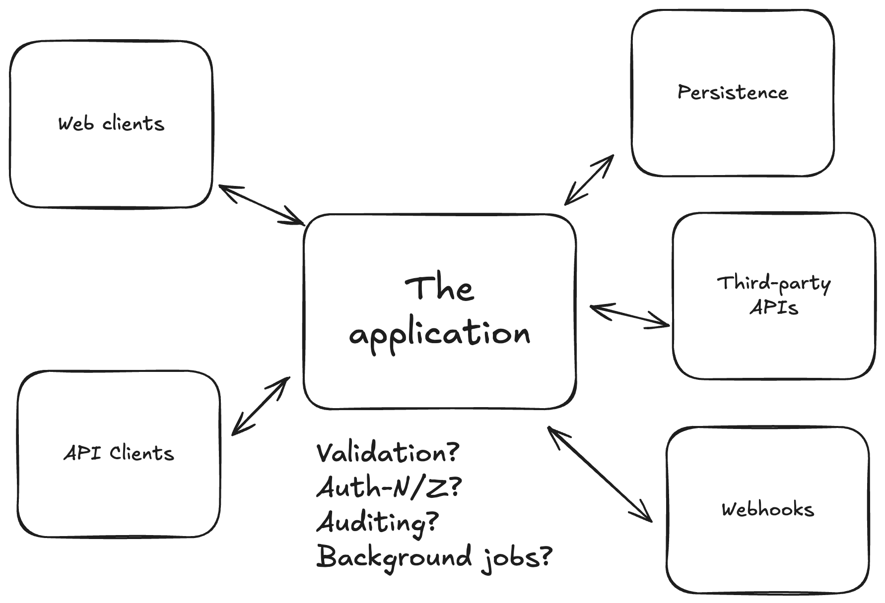
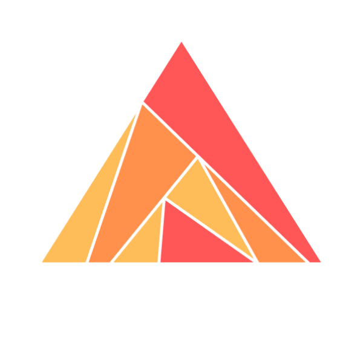
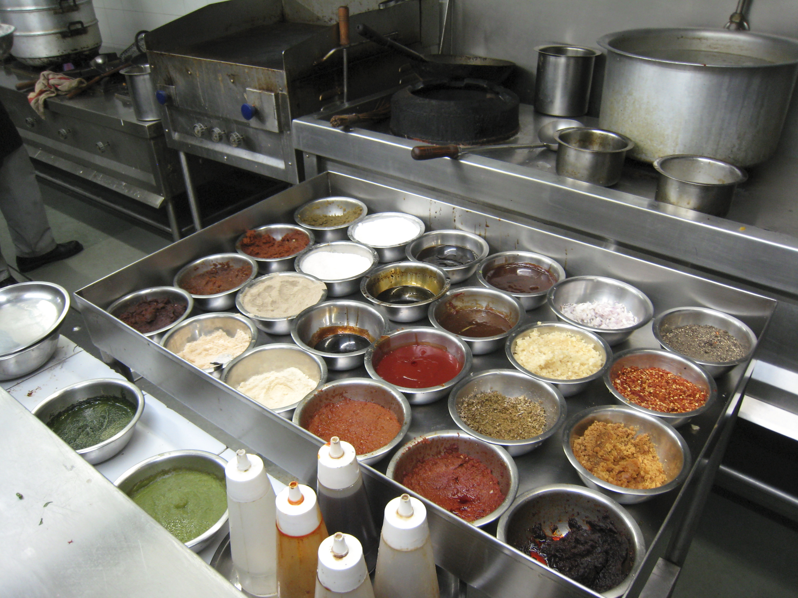
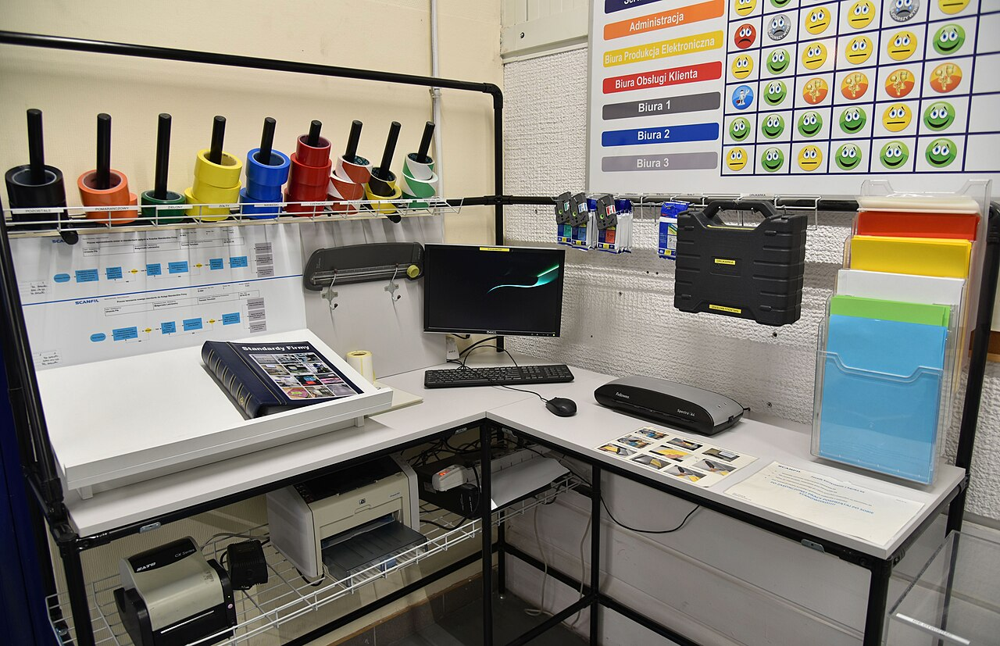
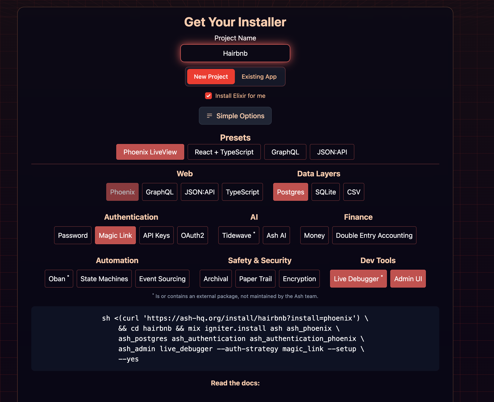

# A developer's journey into ambitious, multi-faceted software

<!-- incremental_lists: true -->
<!-- list_item_newlines: 2 -->
<!-- pause -->

## Elixir: year 1-2

- Building software for the edge
- "Collectors" moving data from A to B
- `GenServer`, `Supervisor`, `Application`
- no HTML, JSON, or SQL in sight


## Elixir: year 3+

- persistence
- third-party integrations
- human interaction 

-----

## Code organsation



-----

## Code organsation

<!-- incremental_lists: true -->

<!-- pause -->
### Asking myself 
- Where should I put this code ...?
- How can I introduce this cross-cutting concern ...? 

<!-- new_lines: 1 -->

### really asking
- ... in a way that keeps the codebase organised ...?
- ... in a way that is consistent ...?
- ... so it works with all the other cross-cutting concerns ...?


<!-- new_lines: 2 -->

### really asking
- ... that I won't "forget" to do each time under a deadline?
- ... and is easy for others to find, understand, extend, and maintain?

-----

## Code organsation

<!-- incremental_lists: true -->
<!-- list_item_newlines: 2 -->
- Model-View-Controller
- Phoenix contexts
  - stacked with libraries and patterns for the concerns (e.g. validation)
- Commanded

-----

<!-- new_lines: 2 -->
<!-- alignment: center -->
Ash framework stumbled upon me one day in Surrey Hills, Sydney...



-----

### Ash framework

<!-- new_lines: 2 -->

<!-- column_layout: [2, 1] -->
<!-- column: 1 -->


<!-- column: 0 -->

<!-- incremental_lists: true -->
<!-- list_item_newlines: 2 -->
- a **declarative** _application_ framework for Elixir
- resource-based: model nouns and verbs of your domain
- agnostic of UI, API, or persistence layers


-----


<!-- alignment: right -->
_https://alembic.com.au/blog/essence-of-ash-framework_

-----

## Realisation

<!-- new_lines: 2 -->
<!-- pause -->
Ash provided _an_ answer to my questions...
<!-- new_lines: 2 -->
<!-- pause -->
What I wanted was a framework that will help me do things right as my application grows and evolves
<!-- new_lines: 2 -->
<!-- pause -->
A framework that has...

_____

# A place for everything and everything in its place


<!-- alignment: center -->
_[1]_      

_____

# A place for everything and everything in its place

<!-- pause -->
Two workspace/workplace organisation terms come to mind...

<!-- list_item_newlines: 2 -->
<!-- incremental_lists: true -->
- Mise en place
- 5S

_____


## Mise en place - [mi zɑ̃ ˈplas]

_putting in place_ / _gathering_


<!-- column_layout: [1, 1] -->
<!-- column: 0 -->


<!-- alignment: right -->
_[2]_


<!-- column: 1 -->


<!-- alignment: right -->
_[3]_

<!-- reset_layout -->

_https://en.wikipedia.org/wiki/Mise_en_place_

-----


## 5S - workplace organisation method

Originating from Japanese JIT manufacturing

<!-- column_layout: [4, 9] -->

<!-- pause -->
<!-- column: 1 -->

<!-- alignment: center -->
_[4]_      


<!-- column: 0 -->
<!-- alignment: left -->
<!-- pause -->

- seiri (整理)
- seiton (整頓)
- seisō (清掃)
- seiketsu (清潔)
- shitsuke (躾)

<!-- new_lines: 1 -->

<!-- pause -->

- sort
- set in order
- shine
- standardise
- sustain

<!-- new_lines: 1 -->
<!-- pause -->
Sadly, relating Ash and 5S will have to wait for another time

<!-- reset_layout -->
<!-- pause -->
<!-- alignment: center -->
https://en.wikipedia.org/wiki/5S_(methodology)

_____

# Mise en place

<!-- new_lines: 2 -->
<!-- pause -->
Let's explore how a culinary philosophy applies to code

_____


## Mise en place - edge Collectors

<!-- new_lines: 2 -->
<!-- column_layout: [2, 3] -->

<!-- pause -->
<!-- column: 1 -->


<!-- column: 0 -->
<!-- alignment: left -->
<!-- pause -->
We have our ingredients in place from OTP and the Elixir standard library:
<!-- list_item_newlines: 2 -->
<!-- incremental_lists: true -->
- `GenServer`
- `Supervisor`
- `Application`
      
<!-- new_lines: 2 -->
<!-- pause -->
For lightweight network services, they can take you a long way
_____

## Mise en place - multi-faceted apps with Ash

<!-- new_lines: 2 -->
The base ingredients: Ash's declarative DSL (Domain Specific Language)
<!-- pause -->
<!-- new_lines: 2 -->
Defines resources, actions, cross-cutting concerns, and their component pieces
<!-- pause -->
<!-- new_lines: 2 -->
Let's see some of the ingredients we can work with

_____


### Resource

The nouns of our system
<!-- pause -->
<!-- new_lines: 2 -->
```elixir
defmodule MyApp.Blog.Post do
  use Ash.Resource, data_layer: AshPostgres.DataLayer

  attributes do
    uuid_primary_key :id

    attribute :title, :string, allow_nil?: false
    attribute :content, :string, allow_nil?: false
    attribute :published_at, :utc_datetime, allow_nil?: true

    timestamps()
  end
end
```

_____

### Actions

The verbs of our system
<!-- pause -->
```elixir {1-20|2-8|11-15|16-20}
defmodule MyApp.Blog.Post do
  actions do
    default: [:read]

    create :create_draft do
      accept [:title, :content] 
    end
  end
end

MyApp.BlogPost
|> Ash.Changeset.for_create(:create_draft,
    %{title: "Title", content: "Some content"},
    actor: current_user)
|> Ash.create!()

PostMyApp.BlogPost
|> Ash.Query.for_read(:read, actor: current_user)
|> Ash.Query.filter(expr(published_at < ago(30, :day)))
|> Ash.read!()
```

_____


### Actions

```elixir {1-17|9-11|13-15}
defmodule MyApp.Blog.Post do
  actions do
    default: [:read]

    create :create_draft do
      accept [:title, :content] 
    end

    read :drafts do
      filter expr(is_nil(:published_at))
    end

    update :publish do
      change set_attribute(:published_at, expr(now()))
    end
  end
end
```

_____

### Actions

```elixir {9-11|1-13}
defmodule MyApp.Blog.Post do
  actions do
    default: [:read]

    create :create_draft do
      accept [:title, :content] 
    end

    update :publish do
      change set_attribute(:published_at, expr(now()))
    end
  end
end
```


_____

### Actions - validate input/pre-conditions

```elixir {10-11|1-15}
defmodule MyApp.Blog.Post do
  actions do
    default: [:read]

    create :create_draft do
      accept [:title, :content] 
    end

    update :publish do
      validate absent(:published_at)

      change set_attribute(:published_at, expr(now()))
    end
  end
end
```
_____

### But `Post`s need authors...

```elixir
defmodule MyApp.Accounts.User do
  use Ash.Resource, data_layer: AshPostgres.DataLayer

  attributes do
    uuid_primary_key :id

    attribute :name, :string, allow_nil?: false
  end
end
```


_____

### Relationships 

```elixir 
defmodule MyApp.Blog.Post do
  actions do
    create :create_draft do
      accept [:title, :content] 
    end
  end
end
```

_____

### Relationships - relational data

```elixir {9-11|6|14|15-17|19-22}
defmodule MyApp.Blog.Post do
  actions do
    create :create_draft do
      accept [:title, :content] 

      change relate_actor(:author)
    end
  end
  relationships do
    belongs_to :author, MyApp.Accounts.User, allow_nil?: false 
  end
end

> some_post = Ash.get!("post_id", actor: :admin)  
   %MyApp.Blog.Post{
     author: %Ash.NotLoaded{}
   }

> Ash.load!(some_post, [:author], actor: :admin)  
   %MyApp.Blog.Post{
     author: %{MyApp.Accounts.User{name: "Brooklyn Bloggs"}}
   }
```


_____

### Relationships - relational data

```elixir 
defmodule MyApp.Accounts.User do
  relationships do
    has_many :posts, MyApp.Post, allow_nil?: true 
  end
end
```
_____

### Fancy relationships 

```elixir {5-11}
defmodule MyApp.Accounts.User do
  relationships do
    has_many :posts, MyApp.Blog.Post, allow_nil?: true 

    has_one :first_post, MyApp.Blog.Post do
      allow_nil?: true

      filter (not(is_nil(published_at)))

      sort published_at: :asc
    end
  end
end
```

_____

### Authorization 

```elixir 
defmodule MyApp.Blog.Post do
  actions do
    update :change_title do
      accept [:title] 
    end
  end
end
```

_____

### Authorization - policies

```elixir {8-17|9-11|13-16}
defmodule MyApp.Blog.Post do
  actions do
    update :change_title do
      accept [:title] 
    end
  end

  policies do
    policy action_type(:update) do
      authorize_if relates_to_actor_via([:author])
    end

    policy action_type(:read) do
      authorize_if relates_to_actor_via([:author])
      authorize_if expr(not(is_nil(published_at)))
    end
  end
end
```
_____

### Derived data - calculations

```elixir
defmodule MyApp.Blog.Post do
  attributes do
    attribute :published_at, :utc_datetime, allow_nil?: true
  end
end
```

_____

### Derived data - calculations

```elixir {1-11|6-10|13-16|16|18}
defmodule MyApp.Blog.Post do
  attributes do
    attribute :published_at, :utc_datetime, allow_nil?: true
  end

  calculations do
    calculate :status, :atom,
       expr(if is_nil(published_at),
         do: :draft, else: :published)
  end
end

some_post
|> Ash.Changeset.for_update(:publish, actor: current_user)
|> Ash.Changeset.update!()
|> Ash.load!([:status], actor: current_user)

  %MyApp.Blog.Post{status: :published}
```

----

## Ash ingredients

<!-- column_layout: [1, 3, 4, 1] -->
<!-- column: 1 -->
<!-- new_lines: 2 -->
<!-- pause -->
We've seen:
<!-- pause -->
- resources
- actions
- validations
- relationships
- authorisation
- calculations

<!-- pause -->
Not to mention:

<!-- incremental_lists: true -->
- aggregates
- preparations
- identities
- multi-tenancy
- notifiers
- pubsub
- ...

<!-- column: 2 -->

<!-- jump_to_middle -->
All of these are defined declaratively, with consistent options, e.g. `load`, and fit together well

----

## Making a meal with Ash

<!-- new_lines: 2 -->
<!-- pause -->
Given our ingredients, how can Ash help us organise our code?

----

### Code interfaces

```elixir 
defmodule MyApp.Blog.Post do
  actions do
    create :create_draft do
      accept [:title, :content] 

      change relate_actor(:author)
    end
  end
```

----

### Code interfaces

```elixir {1-20|10-12|15}
defmodule MyApp.Blog.Post do
  actions do
    create :create do
      accept [:title, :content] 

      change relate_actor(:author)
    end
  end

  code_interface do
    define :create_draft, :create, args: [:title, :content]
  end
end
# for instance, in a Live View
MyApp.Blog.Post.create_draft("Title", "Some content", actor: current_user)
```
_____

### Domains - an essential ingredient ignored until now

<!-- pause -->
Domains: bounded contexts with the dial turned up to 11
<!-- pause -->

```elixir {1-20|4-10|8|13}
defmodule MyApp.Blog do
  use Ash.Domain, ...

  resources do
    resource MyApp.Blog.Post do
      define :create_draft, :create
      define :list_posts, :read
      define :find_post, :read, get_by: :id
    end
  end
end
# for instance, in a Phoenix Controller
MyApp.Blog.find_post!("some_post_id", ...)
```

<!-- pause -->
<!-- new_lines: 1 -->
Domains convinced me that Ash is an answer to my code organisation concerns
_____


## Mise en place - the next level of Ash ingredients

<!-- pause -->
Ash lets us to customise our own ingredients
<!-- pause -->
<!-- new_lines: 1 -->
We can break out of declarative mode and add pure Elixir code
<!-- pause -->
<!-- new_lines: 1 -->
But these are controlled points of customisation, fitting with the rest of the framework
_____

### Derived data - function calculation

```elixir {7-10}
defmodule MyApp.Blog.Post do
  attributes do
    attribute :title, :string, allow_nil?: false
  end

  calculations do
    calculate :slug, :string,
      fn records, _ctx ->
        Enum.map(records, &slugify(&1.title))
      end
  end
end
```

_____

### Actions - change modules

```elixir {1-20, 11-14}
defmodule MyApp.Blog.Post do
  actions do
    default: [:read]

    create :create_draft do
      accept [:title, :content] 
    end

    update :publish do
      change set_attribute(:published_at, expr(now()))
      change __MODULE__.Changes.ScheduleEmailBlast
    end
  end
end
```

_____

### Actions - change modules

```elixir {1-20, 5}
defmodule Post.Changes.ScheduleEmailBlast do
  use Ash.Resource.Change

  def change(changeset, _opts, context) do
    Ash.Changeset.after_action(fn _changeset, record ->
      result = 
        EmailMessage
        |> Ash.Changeset.for_create(:schedule, ...record, ...)
        |> Ash.create()

      case result do
        {:ok, _ } -> {:ok, record}
        {:error, _} -> {:error, ???}
      end
    end)
  end
end
```

____

### Actions - change modules

```elixir
defmodule MyApp.Blog.Post.Changes.ScheduleEmailBlast do
  use Ash.Resource.Change

  def change(changeset, _opts, context) do
    Ash.Changeset.after_action(fn _changeset, record ->
      result = 
        EmailMessage
        |> Ash.Changeset.for_create(:schedule, ...record, ...)
        |> Ash.create()

      case result do
        {:ok, _ } -> {:ok, record}
        {:error, _} -> {:error, ???}
      end
    end)
  end
end
```
<!-- pause -->
This is exactly how builtins, like `set_attribute` are implemented under the hood

____

### Behaviour modules

<!-- new_lines: 1 -->
<!-- pause -->
We just saw a `change` module
<!-- new_lines: 1 -->
<!-- pause -->
Module implementations can be made for other features:
<!-- new_lines: 1 -->
<!-- incremental_lists: true -->
<!-- list_item_newlines: 2 -->
- calculations
- validations
- preparations

<!-- new_lines: 1 -->
<!-- pause -->
An opportunity for code reuse

_____

## Mise en place - the next level of Ash ingredients

<!-- pause -->
Ash allows us to implement customisations of our code ingredients

<!-- new_lines: 1 -->
<!-- pause -->
But there's always another level

_____

## The next, next level of Ash ingredients

<!-- new_lines: 1 -->
<!-- pause -->
Ash's declarative style is powered by Spark: https://github.com/ash-project/spark
<!-- new_lines: 1 -->
<!-- pause -->
Spark is a DSL builder, applicable to any Elixir DSL use-case, not just Ash
<!-- new_lines: 1 -->
<!-- pause -->
<!-- incremental_lists: true -->
<!-- list_item_newlines: 2 -->
- Spark DSL programs (like an Ash application) are data structures defined by a schema
- we can add and modify sections and entities in the DSL with extensions and transformers

____


### A Spark extension

The following examples are taken from https://hexdocs.pm/ash/writing-extensions.html

<!-- pause -->
```elixir
defmodule MyApp.Extensions.Base do
  use Spark.Dsl.Extension, transformers: [MyApp.Extensions.Base.AddTimestamps]
end
```

-----

### A Spark extension

```elixir
defmodule MyApp.Extensions.Base do
  @base %Spark.Dsl.Section{
    name: :base,
    describe: "Configure the behavior of our base extension.",
    examples: [ "base do timestamps? false end" ],
    schema: [
      timestamps?: [
        type: :boolean,
        doc: "Set to false to skip adding timestamps",
        default: true
      ]
    ]
  }

  use Spark.Dsl.Extension,
    transformers: [MyApp.Extensions.Base.AddTimestamps],
    sections: [@base]
end
```
_____

### A Spark extension - transformer

```elixir
defmodule MyApp.Extensions.Base.AddTimestamps do
  use Spark.Dsl.Transformer
  alias Spark.Dsl.Transformer

  def transform(dsl_state) do
    dsl_state
    # Ash.Resource.Builder has utilities for extending resources
    |> Ash.Resource.Builder.add_new_create_timestamp(
      :inserted_at)
    |> Ash.Resource.Builder.add_new_update_timestamp(
      :updated_at)
  end
end
```
_____

### A Spark extension - transformer

```elixir
defmodule MyApp.Tweet do
  use Ash.Resource,
    extensions: [MyApp.Extensions.Base]

  base do
    # And you can configure it like so
    timestamps? false
  end
end
````
_____

## Ash extensions

<!-- new_lines: 1 -->
<!-- pause -->
Ash extensions, powered by Spark, help fulfil the tagline:
<!-- new_lines: 1 -->
<!-- pause -->
<!-- alignment: center -->
_Model your domain, derive the rest_
<!-- new_lines: 1 -->
<!-- pause -->
<!-- alignment: left -->
The Ash open source ecosystem is based around useful extensions 

_____

### AshJsonAPI example

<!-- pause -->
Add JSON:API routes to your application: https://github.com/ash-project/ash_json_api
<!-- pause -->

<!-- column_layout: [5, 4] -->
<!-- column: 0 -->
```elixir
defmodule MyApp.Blog do
  use Ash.Domain, ...

  alias MyApp.Blog.Post

  resources do
    resource Post do
      define :create_draft, :create
      define :list_posts, :read
    end
  end

  json_api do
    routes do
      base_route "/posts", Post do
        get :read
        index :read
        post :create
      end
    end
  end
end

```

<!-- pause -->
<!-- column: 1 -->
```bash
curl https://example.com/posts/post-id

{
  "data": {
    "attributes": {
      "published_at": "2025-09-23T14:30:00Z",
      "title": "First Post!",
      "content": "...",
      "slug": "first-post",
      ...
    },
    "id": "post-id",
    "relationships": {...}
  },
  "included": [...],
  "meta": {...}

```
____


### Ash extensions

<!-- column_layout: [5, 4] -->
<!-- column: 1 -->

<!-- alignment: right -->
https://ash-hq.org/#get-started

<!-- column: 0 -->
<!-- new_lines: 2 -->
<!-- incremental_lists: true -->
<!-- list_item_newlines: 2 -->
- AshAuthentication - multi-strategy authentication
- AshOban - scheduled and background jobs with Oban/ObanPro
- AshGraphQL - turn actions into Absinthe queries and mutations
- AshPaperTrail - versioning and auditing for resource changes
- AshTypeScript - type-safe RPC for TypeScript applications
- ...

____

# Ash ingredients

<!-- new_lines: 1 -->
<!-- incremental_lists: true -->
<!-- list_item_newlines: 2 -->
- declarative DSL with cross-cutting concerns built-in (e.g. relations, validations, calculations, policies) that fit together
- multiple extension points with progressive levels of code organisational clarity
  - do it the Right Way (TM)
  - seamless retrofit
- gather ingredients at the meta-level - Spark Extensions
- extension ecosystem for everything needed to build modern multi-faceted apps

<!-- new_lines: 1 -->
<!-- alignment: center -->
<!-- pause -->
All these properties together is why I say:
  
----

<!-- jump_to_middle -->
<!-- alignment: center -->
 Ash has a place for everything and everything in its place

____

# Image attributions

- [1] Shadow board
  - https://upload.wikimedia.org/wikipedia/commons/9/98/Papan_Bayangan_%28Shadow_Board%29.jpg
  - Encik Tekateki, CC BY-SA 4.0 https://creativecommons.org/licenses/by-sa/4.0> via Wikimedia Commons
<!-- new_lines: 1 -->
- [2] Hot station
  - https://www.flickr.com/photos/haynes/500435491,
  - Charles Haynes, CC BY-SA 2.0, https://commons.wikimedia.org/w/index.php?curid=35488828
<!-- new_lines: 1 -->
- [3] Ingredients
  - https://unsplash.com/photos/a-bunch-of-bowls-filled-with-different-types-of-food-3GArfxm0p9M
  - Shaun Tilburg

_____

# Image attributions

- [4] Resource corner
  - https://commons.wikimedia.org/wiki/File:Resource_corner_5S_Safety_close-up_Scanfil_Sieradz.jpg
  - Adrian Grycuk, CC BY-SA 3.0 PL https://creativecommons.org/licenses/by-sa/3.0/pl/deed.en, via Wikimedia Commons
